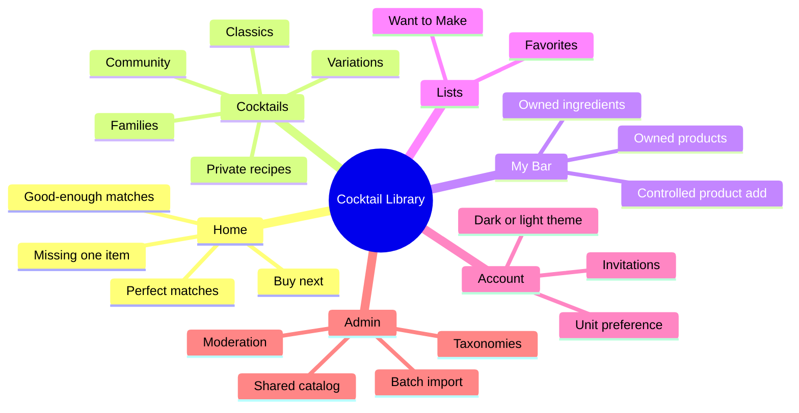
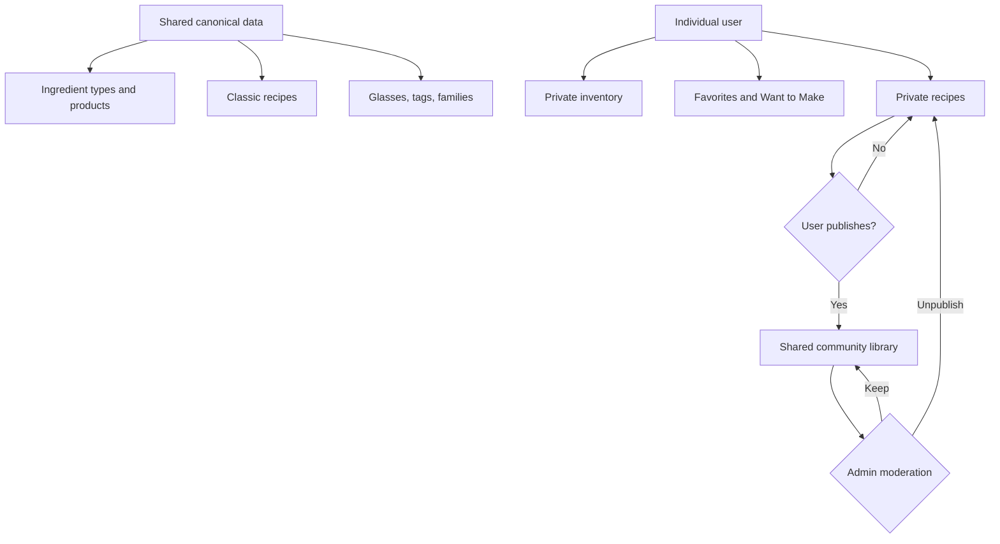
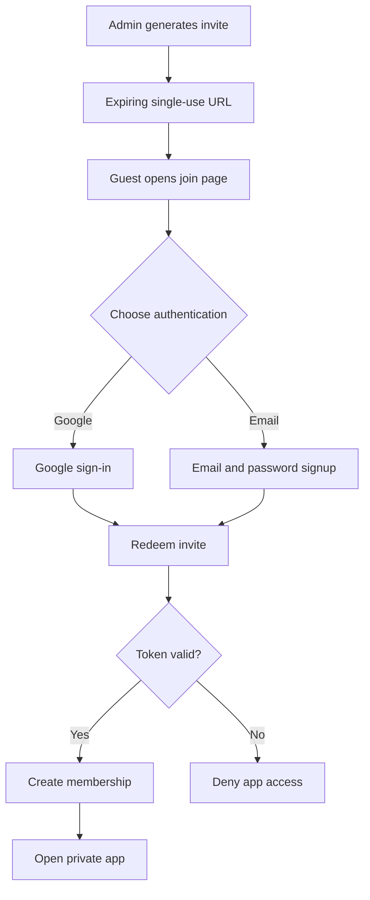
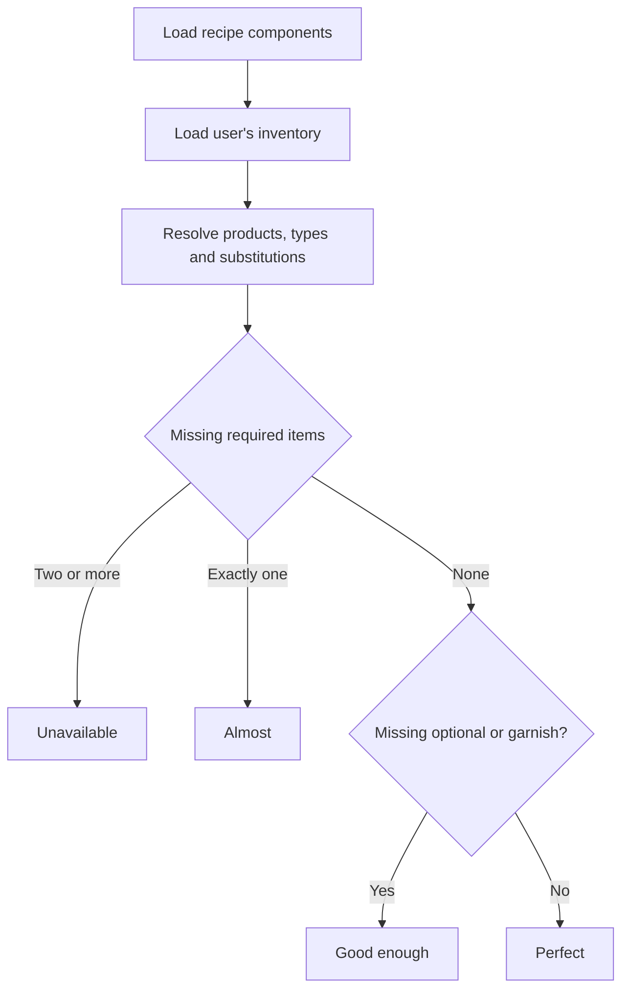
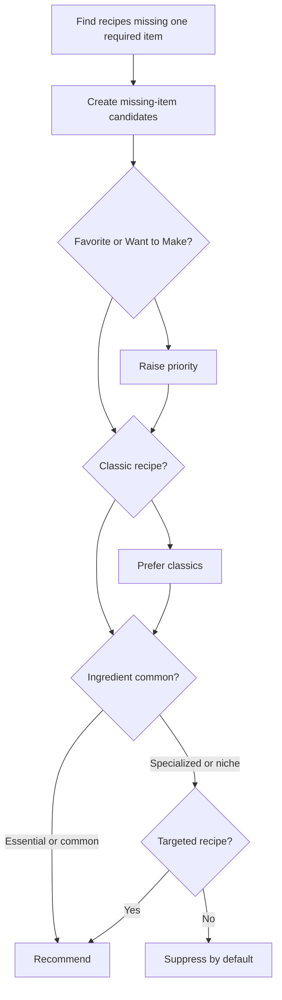
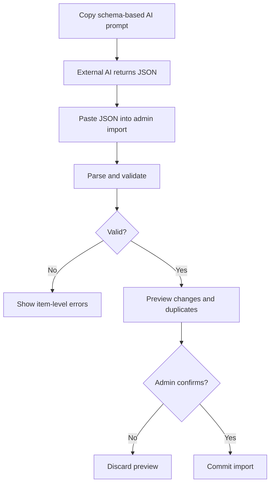
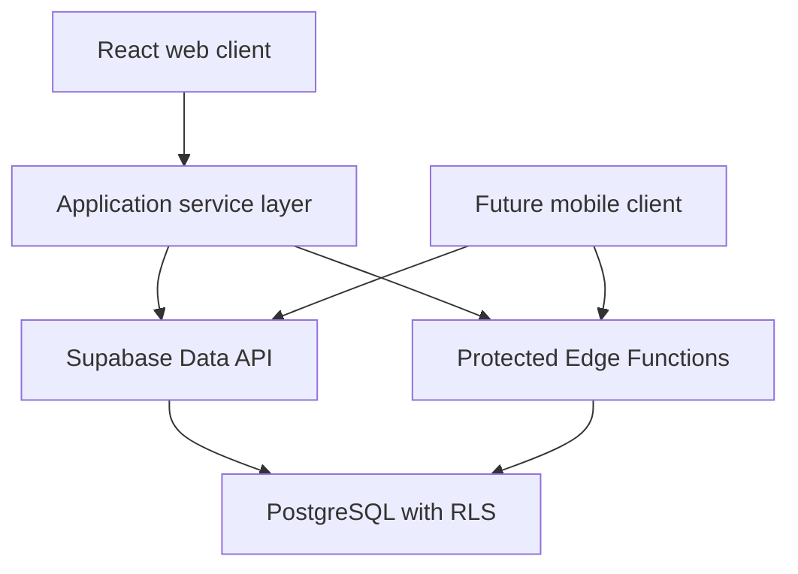

# Cocktail Library — App and Process Maps

## 1. App map

## 2. Data ownership map

## 3. Invitation and access process

## 4. Recipe availability process

## 5. Shopping recommendation process

## 6. Batch import process

## 7. Technical boundary

